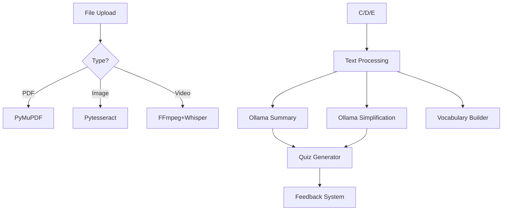

Here's a reorganized and comprehensive TODO list for your StudyAI backend project, structured by core functionality with technical specifics:

---

# 🚀 **StudyAI Backend Roadmap**

## 🔐 **1. Authentication & User Management**
- [ ] Implement JWT authentication/ standby
- [x] User registration/login endpoints
- [ ] Password hashing (bcrypt) /standby
- [x] User profile management (CRUD)

## 📂 **2. File Processing Pipeline**
### **PDF Processing**
- [x] PDF text extraction (PyMuPDF)
- [x] Handle scanned PDFs (Tesseract OCR)
- [ ] Table extraction (camelot/tabula)

### **Image Processing**
- [x] Text extraction (Pytesseract)
- [x] Math equation detection (LaTeX output)
- [ ] Diagram interpretation

### **Video Processing**
- [x] Frame extraction (FFmpeg)
- [x] Audio transcription (Whisper)
- [x] Slide detection (OpenCV)

## 🧠 **3. AI Processing Core**
### **Text Transformation**
- [x] Summary generation (Ollama)
- [x] Simplification (Ollama)
- [x] Key concept extraction
- [x] Prerequisite identification

### **Quiz Generation**
- [ ] Multiple-choice questions
- [ ] True/False questions
- [ ] Fill-in-the-blank
- [ ] Adaptive difficulty scaling

### **Vocabulary Builder**
- [x] Term-definition extraction

## 💬 **4. Chatbot Integration**
- [ ] Context-aware Q&A
- [ ] Lecture material comprehension
- [ ] Mistake explanation
- [ ] Study plan advisor

## 📊 **5. Feedback System**
- [ ] Quiz performance analytics
- [ ] Knowledge gap identification
- [ ] Personalized recommendations
- [ ] Difficulty adjustment

## 🛠 **6. Infrastructure**
- [x] PostgreSQL schema optimization
- [ ] Vector embeddings for search
- [ ] Async processing queues
- [ ] Rate limiting

## 🧪 **7. Testing**
- [ ] File processing unit tests
- [ ] AI output validation
- [ ] Load testing
- [ ] Edge case handling

## 📄 **8. Documentation**
- [x] API reference (Swagger/Redoc)
- [x] Architecture diagrams
- [x] Model training data
- [ ] Deployment guide

## 🔄 **Workflow**

**Key Libraries:**
- `PyMuPDF` - PDF text extraction
- `Pytesseract` - OCR for images
- `FFmpeg` - Video frame extraction
- `Whisper` - Audio transcription
- `Ollama` - All text generation tasks
- `SentenceTransformers` - Vector embeddings

Would you like me to prioritize these tasks or elaborate on any specific section?